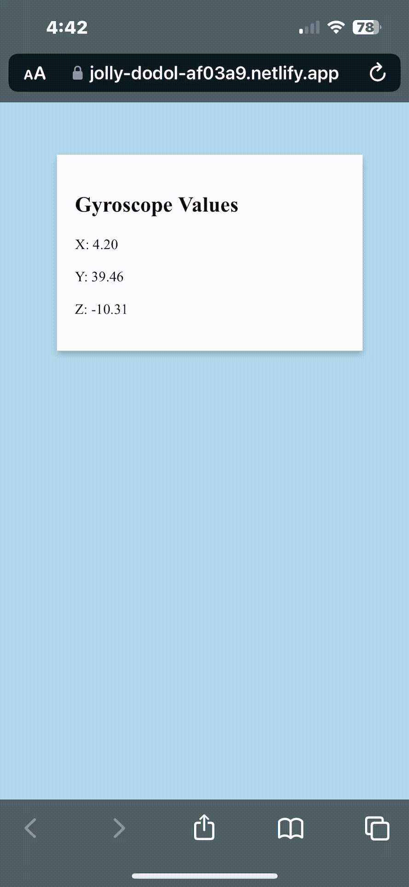

# nettest
A tool hosted on Netlify which displays the gyroscopic orientation of your device.

# Requirements
Windows, IOS, Android

## Usage

Head to https://jolly-dodol-af03a9.netlify.app/ and click "Start"
